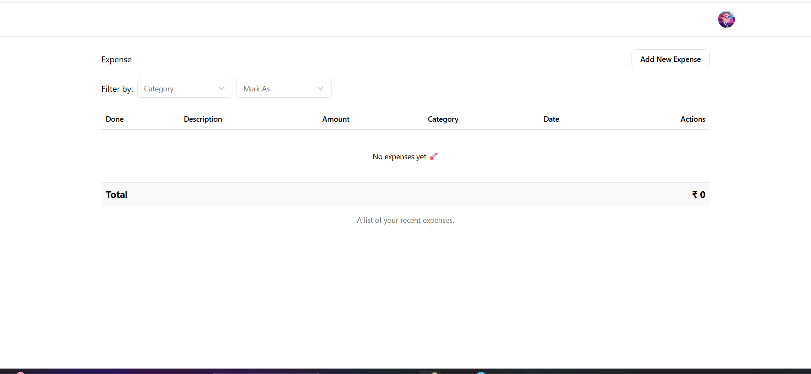
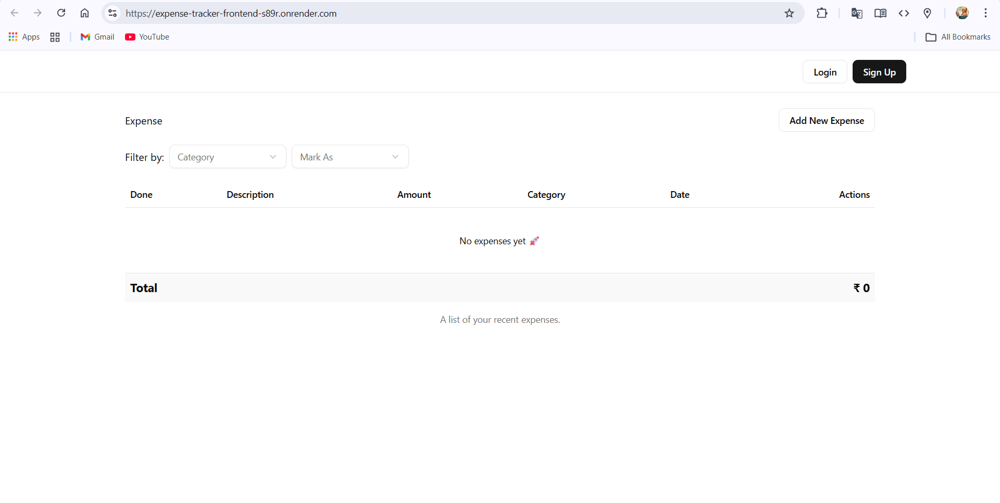
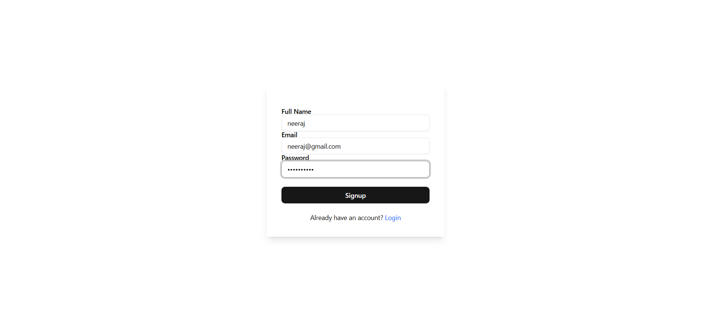
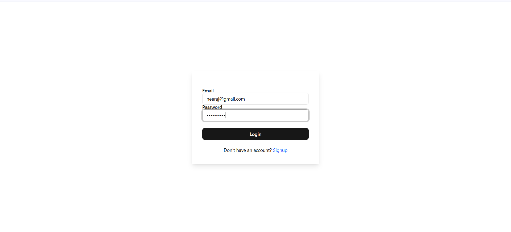
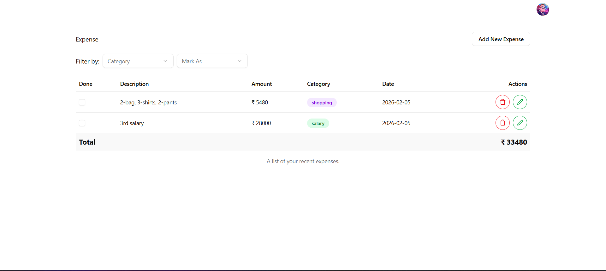
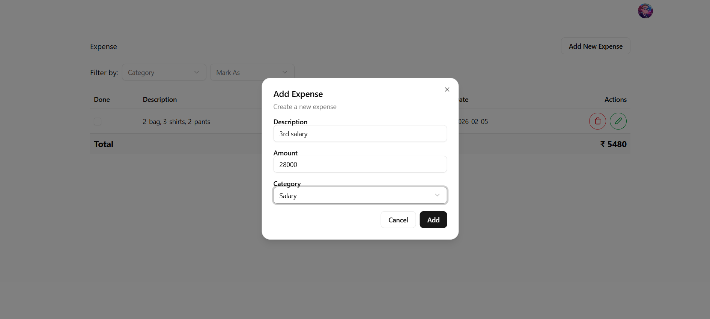
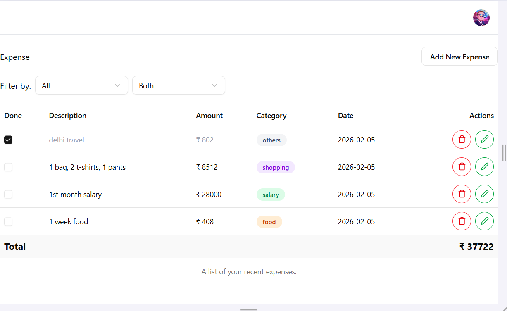
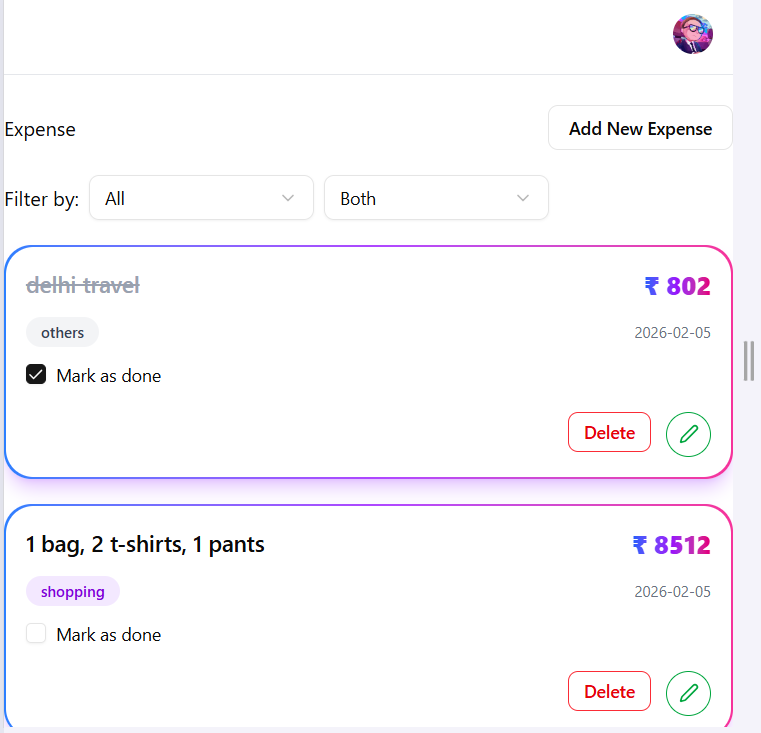

# 💰 Expense Tracker – MERN Stack

A full-stack Expense Tracker application built using the **MERN stack**.  
This app allows users to securely track their daily expenses with authentication, CRUD operations, and a clean responsive UI.

---

## 🚀 Live Demo

🔗 **Frontend**: https://expense-tracker-frontend-s89r.onrender.com
🔗 **Backend API**: https://expense-tracker-backend-ierk.onrender.com  

---

## 🛠 Tech Stack

### Frontend
- React.js
- Axios
- CSS / Tailwind CSS
- Vite

### Backend
- Node.js
- Express.js
- MongoDB
- Mongoose
- JWT Authentication
- Cookie-based Auth

### Deployment
- Render (Frontend + Backend)
- MongoDB Atlas

---

## ✨ Features

- 🔐 User Authentication (Login / Signup)
- 🍪 Secure Cookie-based JWT Authentication
- ➕ Add new expenses
- ✏️ Update existing expenses
- ❌ Delete expenses
- 📊 View expenses in tabular format
- 📱 Fully Responsive UI (Mobile & Desktop)
- 🔄 Centralized Axios API configuration
- 🌐 Environment-based configuration

---

## 📁 Project Structure

```text
expense-tracker-mern-stack/
│
├── backend/
│   ├── controllers/
│   ├── models/
│   ├── routes/
│   ├── middlewares/
│   ├── config/
│   └── server.js
│
├── frontend/
│   ├── src/
│   │   ├── api/
│   │   │   └── axios.js
│   │   ├── components/
│   │   ├── hooks/
│   │   ├── pages/
│   │   └── App.jsx
│   └── main.jsx
│
└── README.md
```

## 📸 Screenshots

### 👀 First Look


### 🧾 Before Signup


### 📝 Signup


### 🔐 Login



### 📊 Dashboard


### ➕ Add Expense


### 💻 Laptop View


### 📱 Mobile View

